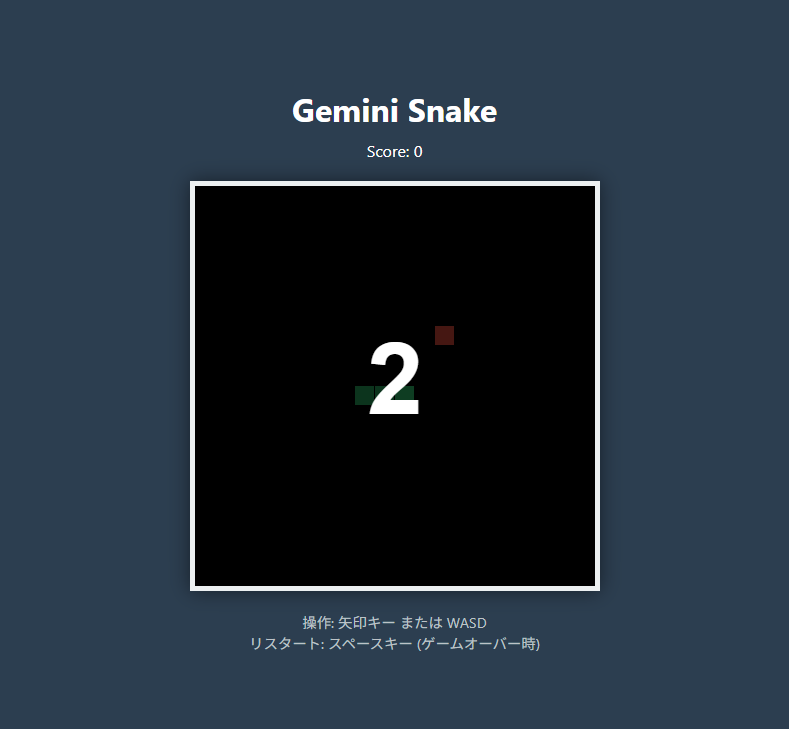
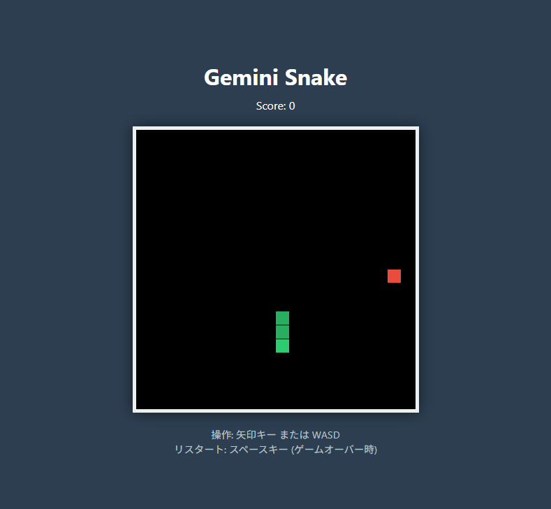
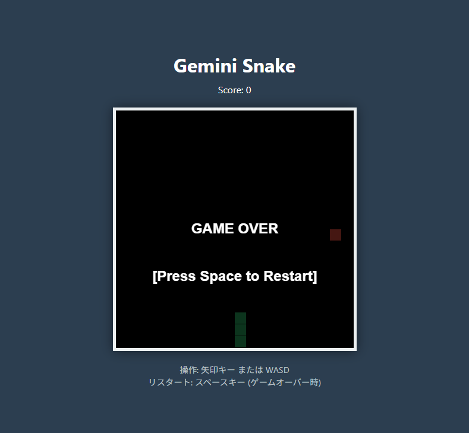
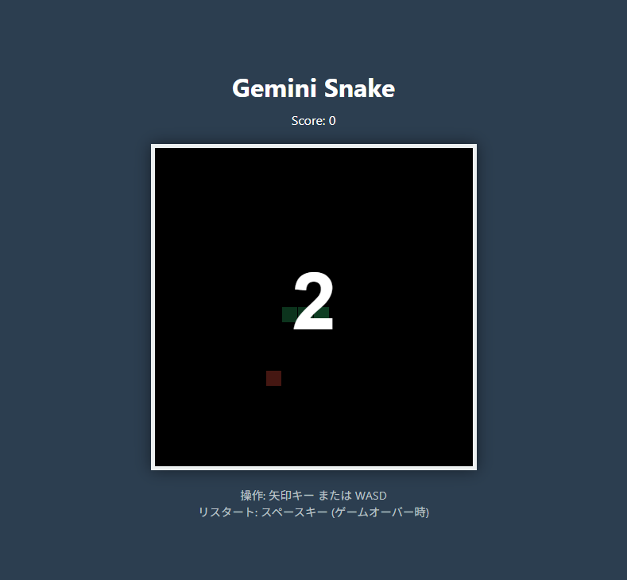

# Gemini Snake Game E2E テスト仕様書兼エビデンス報告書

**テスト対象:** `index.html` (ローカル起動中: `http://localhost:3000`)
**テスト手法:** Playwright MCPを用いたブラックボックステスト

## テストケース一覧と結果

| ID | テスト内容 | 期待値 | 結果 |
| :--- | :--- | :--- | :---: |
| TC-01 | 初期表示の確認 | タイトル、キャンバス、スコア(0)、説明文が描画されること | PASS ✔️ |
| TC-02 | スネークの移動操作 | 矢印キー入力で指定方向へスネークが移動すること | PASS ✔️ |
| TC-03 | ゲームオーバー処理 | 壁に衝突後、「GAME OVER」画面が正しく表示されること | PASS ✔️ |
| TC-04 | リスタート機能 | スペースキー押下でゲームが初期状態から再開されること | PASS ✔️ |

---

## 実行エビデンス（スクリーンショット）

### TC-01: 初期表示の確認
ページロード後、タイトル、現在のスコア（0）、キャンバス、およびカウントダウンが正常に表示されることを確認しました。

### TC-02: スネークの移動操作
カウントダウン終了直後に下向き矢印キーを入力した結果、スネークが下方向に移動し続ける動作を確認しました（緑色のブロックが縦に連長している状態）。

### TC-03: ゲームオーバー処理（壁への衝突）
無操作のままスネークをキャンバス外（下の壁）に意図的に衝突させたところ、「GAME OVER」のテキストと「[Press Space to Restart]」の案内が表示されることを確認しました。

### TC-04: リスタート機能
ゲームオーバー状態で「スペースキー」を入力したところ、画面が初期状態にリセットされ、再び新しいゲームのカウントダウンが始まることを確認しました。

---

**総評:** 
すべてのテストケースが期待通りにパスしました。Gemini Snake Game（ `index.html` ）の主要機能群において、致命的なバグや表示崩れ等は検知されませんでした。
